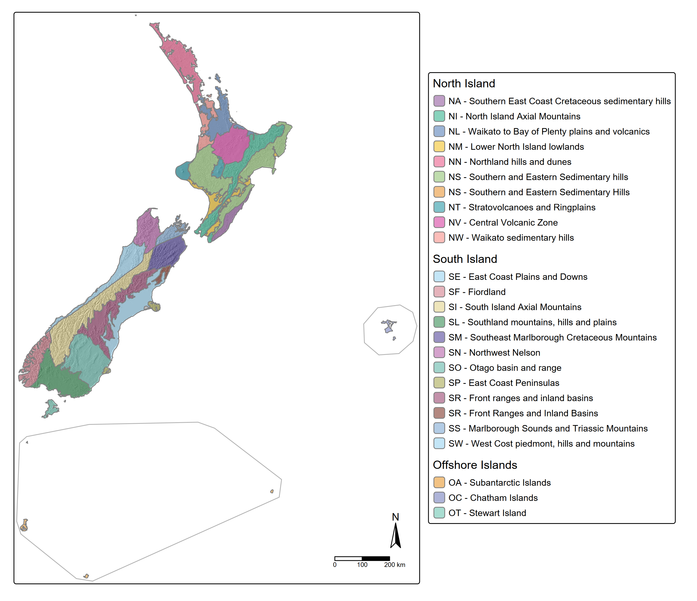

# Geomorphology {#sec-gmph}

```{r}
library(dplyr)
library(tibble)
library(gt)
library(gtExtras)
```

Geomorphology limits the range of soils than can occur at specific locations on the basis of slope, relief, aspect, and drainage. Geomorphology can be described at multiple scales, which break down into progressively simpler shapes. The system described in this chapter helps the pedologist to do that consistently.

In this system, the chosen scales are Province (@sec-gmph-prov), Landscape (@sec-gmph-lsc), and Landform (@sec-gmph-lfm) as described below. Provinces are large, continuous regions of New Zealand (and its outlying islands) that have a distinctive character driven mostly by their geology and climate. Within provinces, landscapes describe assemblages of spatially related landforms that may form semi-regular patterns. Within landscapes, individual landforms comprise local expressions of earth, air and water movement over time.

Some additional, highly local geomorphology parameters are captured when describing the land surface at a site (@sec-pr-surface).

## Province {#sec-gmph-prov}

Provinces identify major geomorphic zones in New Zealand, expressive of large-scale lithological associations, tectonic regime, and climate. @tbl-ss-lftp lists their names and @fig-ss-lftp shows their general distribution. Full definitions of the provinces are in @sec-ap-prov.

|   | Northern Provinces |   | Southern Provinces |   | Offshore Provinces |
|:-----------|:-----------|:-----------|:-----------|:-----------|:-----------|
| [NN]{.ceg} | [Northland hills and dunes](ap_province.qmd#sec-ap-prov-nn) | [SI]{.ceg} | [South Island axial mountains](ap_province.qmd#sec-ap-prov-si) | [OT]{.ceg} | [Stewart Island](ap_province.qmd#sec-ap-prov-ot) |
| [NL]{.ceg} | [Waikato to Bay of Plenty plains and volcanics](ap_province.qmd#sec-ap-prov-nl) | [SR]{.ceg} | [Front Ranges and inland basins](ap_province.qmd#sec-ap-prov-sr) | [OC]{.ceg} | [Chatham Islands](ap_province.qmd#sec-ap-prov-oc) |
| [NW]{.ceg} | [Waikato sedimentary hills](ap_province.qmd#sec-ap-prov-nw) | [SO]{.ceg} | [Otago basin and range](ap_province.qmd#sec-ap-prov-so) | [OS]{.ceg} | [Subantarctic Islands](ap_province.qmd#sec-ap-prov-os) |
| [NV]{.ceg} | [Central Volcanic Zone](ap_province.qmd#sec-ap-prov-nv) | [SF]{.ceg} | [Fiordland](ap_province.qmd#sec-ap-prov-sf) |  |  |
| [NT]{.ceg} | [Stratovolcanoes and ringplains](ap_province.qmd#sec-ap-prov-nt) | [SW]{.ceg} | [West coast piedmont, hills and mountains](ap_province.qmd#sec-ap-prov-sw) |  |  |
| [NI]{.ceg} | [North Island Axial Mountains](ap_province.qmd#sec-ap-prov-ni) | [SN]{.ceg} | [Northwest Nelson](ap_province.qmd#sec-ap-prov-sn) |  |  |
| [NS]{.ceg} | [Southern and Eastern Sedimentary Hills](ap_province.qmd#sec-ap-prov-ns) | [SS]{.ceg} | [Marlborough Sounds and Triassic Mountains](ap_province.qmd#sec-ap-prov-ss) |  |  |
| [NM]{.ceg} | [Lower North Island lowlands](ap_province.qmd#sec-ap-prov-nm) | [SM]{.ceg} | [Southeast Marlborough Cretaceous Mountains](ap_province.qmd#sec-ap-prov-sm) |  |  |
| [NA]{.ceg} | [Southern East Coast Cretaceous sedimentary hills](ap_province.qmd#sec-ap-prov-na) | [SP]{.ceg} | [East Coast Peninsulas](ap_province.qmd#sec-ap-prov-sp) |  |  |
|  |  | [SE]{.ceg} | [East Coast Plains and Downs](ap_province.qmd#sec-ap-prov-se) |  |  |
|  |  | [SL]{.ceg} | [Southland mountains, hills and plains](ap_province.qmd#sec-ap-prov-sl) |  |  |

: Landscape provinces of New Zealand {#tbl-ss-lftp .hover .striped tbl-colwidths="\[5,29,5,28,5,28\]"}

{#fig-ss-lftp .lightbox width="85%" fig-alt="A map of New Zealand depicting the boundaries of landform Provinces."}

Given their very broad extent, province does not need to be recorded in the field. The province boundaries are not currently strictly defined so an understanding of their conceptual basis (@sec-ap-prov) is required before a confident allocation can be made.

## Landscape {#sec-gmph-lsc}

The landscape around a soil observation comprises a distinct geomorphological pattern with repeating landforms, or landforms that are otherwise spatially related. The scale of observation varies but commonly extends from a few hundred to a few thousand meters [@heck2017]. Landscapes nest within Provinces but are not exclusive to one or another.

### Naming landscapes {#sec-gmph-lscnm}

Few controlled vocabularies for landscapes exist. The schema given in @tbl-gmph-lsnames below is provisional and based on terms seen in common use in New Zealand environmental datasets.

```{r}
#| label: tbl-gmph-lsnames
#| tbl-cap: "Common Landscape terms"

dat_gmph_lsnames <-
  tribble(~Code, ~Name, ~Description, ~Synonyms,
          'Mt', 'Mountains', 'Steep to very steep, high relief (>300 m), fixed and well connected drainage pattern with high stream power, often deeply incised', 'Alps, Mountain country',
          'Hi', 'Hills', 'Gentle to very steep, moderately high to high relief (90-300 m), fixed and well connected drainage pattern with high to moderate stream power, shallow to deeply incised', 'Hillscapes, hill country, hilly land',
          'Vo', 'Volcanoes', 'Moderate to very steep, usually high relief, often with a radial drainage pattern with high to moderate stream power that has been interrupted by past eruptive events', '',
          'Up', 'Uplands', 'Gentle to very steep, low relief (30-90 m) but relatively high elevation, fixed and well connected drainage pattern with low stream power, shallow valleys and plateaus, located among hills and mountains', 'Piedmont',
          'Ll', 'Lowlands', 'Gentle to very steep, low relief (30-90 m) and elevation, someties loess-covered, fixed and well connected drainage pattern with low stream power, shallow to deep', 'Downlands',
          'Vl', 'Volcanic lowlands', 'Level to gentle, sometimes highly uneven or hummocky surfaces created by lava flows, lahars and debris avalanches, often blanketed in airfall tephra. Drainage pattern has variable stream power and may be discontinuous or even absent', 'Moundplains, ringplains', 
          'Te', 'Terraces', 'Former plains, uplifted and sometimes loess-covered. Flat to gently undulating upper surfaces bounded by distinctive drop-offs on their downhill end, often backing on to lowlands, hills or mountains at their uphill end. Variably developed drainage pattern with low to moderate stream power, often strongly controlled by underlying geology', 'Marine benches',
          'Pl', 'Plains', 'Level to very gentle surfaces created by fluvial and/or aeolian deposition. Active, migrating drainage pattern with shallow to deep channels and variable stream power, subject to flooding', 'Floodplains',
          'Sc', 'Sand country', 'Extensive dune and sandplain areas. Low relief and elevation, gentle to steep slopes, and active drainage pattern of variable power, often with interrupted connectivity', 'Dunefields',
          'Cs', 'Coasts', 'On- and near-shore environments created by the interaction of the ocean with the land, including beaches, deltas, lagoons and estuaries. Drainage pattern active and subject to tidal influence', 'Coastlines'
          )

tbl_gmph_lsnames <- gt(dat_gmph_lsnames) |>
   tab_options(
    column_labels.font.weight = 'bold', 
    heading.title.font.weight = 'bold',
    table.align = 'center',
    table.width = '85%'
  ) |>
  tab_style(style = list(cell_text(color  = 'red',
                                   weight = 'bold',
                                   align  = 'center')),
            locations = cells_body(columns = 1)) |>
  cols_label(Synonyms = 'Synonyms and subtypes') |>
  cols_width(Code ~pct(10), Name ~pct(20), Synonyms ~pct(20))

tbl_gmph_lsnames

```

### Describing landscapes {#sec-gmph-lscpar}

A landscape can be described in terms of a short list of parameters: relief, characteristic slope, drainage pattern, structural controls, and the landforms contained within the landscape. These parameters may be useful when mapping at regional scale, but do not need to be routinely recorded in the field.

#### Relief {#sec-gmph-lscrel}

Relief is the degree of separation between high and low points in a landscape. As described in @ncst2024 [p. 36], relief can be visualised by picturing two surfaces roughly parallel to the land surface - one passing through local crests and one through local depressions. The median vertical distance between the two surfaces is the relief.

[add a diagram here]{.diags}

Relief is usually best determined from a DEM that has been zoned into landscape units. Relief classes may be applied to the recorded data; see @sec-reliefclass.

#### Characteristic slope {#sec-gmph-lscslp}

The characteristic slopes are the most common range of slopes within a regional landscape. These are often controlled by local geology.

As with relief, characteristic slope is usually best determined from zonal analysis of a DEM-derived slope dataset. Zonal data should be recorded in terms of median and range, in whole degrees. Slope classes may be applied to the recorded data; some options are presented in @sec-slopeclass.

::: {#nte-multislopes .callout-note appearance="simple" collapse="true" title="Multiple characteristic slopes"}
Some landscapes may have two or more distinct characteristic slopes, e.g. the fronts and tops of alluvial terrace landforms on a plain. In this case the median will describe the dominant surface while the range will capture the steeper areas. Recording multiple characteristic slopes at landscape scale is not considered useful, as adequate context is provided by naming the landscape and its component landforms.
:::

#### Drainage pattern {#sec-gmph-lscchn}

Natural drainage patterns are relevant to understanding landscape development, but are best observed remotely. They do not need to be recorded in the field. If desired, assess the landscape drainage pattern using available data sources and define it using the attributes given in [-@ncst2024, p. 38-41].

#### Structural controls {#sec-gmph-lscst}

A landscape may be strongly controlled by the structure of the underlying geology, which can in turn influence landforms and patterns of soil formation. These controls are particularly noticeable on erosive sedimentary landscapes. These may be noted where relevant.

```{r}
#| label: tbl-hr-lscstr
#| tbl-cap: "Common structural controls on landscapes"

dat_hr_lscstr <-
  tribble(~Code, ~Name, ~Description,
          'F', 'Flat strata', 'Landscape development is influenced by horizontal or near-horizontal strata, where layers of more resistant material form elevated caps or benches',
          'T', 'Tilted strata', 'Landscape development is influenced by tilted or folded strata creating alternately shallow and steeper slopes (homoclinal hills, cuestas), or bands of contrasting lithology',
          'U', 'Uplift', 'Landscape has been subject to geologically recent sudden uplift and/or lateral movement due to a major earthquake, e.g. causing more intense down-cutting in drainage systems or triggering major landslides',
          'L', 'Fault', 'Landscape has been significantly interrupted by faultlines, for instance displacing drainage patterns',
          'K', 'Karst', 'Landscape development is influenced by dissolution of limestone, for example creating sinkholes',
          'G', 'Glaciation', 'Landscape development is/was driven by glaciation, for example creating u-shaped valleys')

tbl_hr_lscstr <- gt(dat_hr_lscstr) |>
   tab_options(
    column_labels.font.weight = 'bold', 
    heading.title.font.weight = 'bold',
    table.align = 'center',
    table.width = '85%'
  ) |>
  tab_style(style = list(cell_text(color  = 'red', 
                                   weight = 'bold',
                                   align  = 'center')),
            locations = cells_body(columns = 1)) |>
  cols_width(Code ~pct(10), Name ~pct(20))

tbl_hr_lscstr

```

#### Composition {#sec-gmph-lsccmp}

A breakdown of the major landforms expected within the landscape should be included (see @sec-gmph-lfm below) along with an estimate of their relative dominance.

## Landform {#sec-gmph-lfm}

A landform is a component of the landscape, and again can have a variable extent - usually 10's to 100's of meters. A landform has a relatively simple shape compared to the landscape, and is not itself composed of multiple repeating elements in the way that a landscape is. A landform has a characteristic range of slopes and aspects. Landforms also have distinctive composition in terms of geology/parent materials and are usually restricted to particular locations within a landscape.

### Naming Landforms {#sec-gmph-lfmnm}

Few controlled vocabularies for landforms exist. The schema given in @tbl-gmph-lfnames below is provisional and based on terms seen in common use in New Zealand environmental datasets and related publications. An extensive dictionary of landform terminology can also be found in @schoeneberger2017.

```{r}
#| label: tbl-gmph-lfnames
#| tbl-cap: "Common soil-bearing landforms of New Zealand (adapted from @milne1995, @johnson2004, @tielidze2021, and @ncst2024)"

dat_gmph_lfnames <-
  tribble(~Code, ~Name, ~Description, ~Synonyms,
          # natural
          'Ba', 'Bar', 'A ridge-like accumulation of sand, gravel, or other alluvial material formed in the channels, along the banks, or at the mouth of a stream where a decrease in velocity induces deposition', 'sandbar, channel bar, meander bar',
          'Bc', 'Beach', 'Low-slope, shorefront accumulation of unconsolidated sediment (usually sand to cobble sized)', '',
          'Bk', 'Backplain', 'Very gentle to flat alluvial plain that is slightly concave in cross section and/or slopes away from a nearby channel. Often bounded by a levee along the channel side', '',
          'Bn', 'Bank', 'Very gentle to steep slopes along the sides of a channel', 'riverbank', 
          'Bp', 'Beach plain', 'Coastal plain buit up by wave and tidal action on an aggrading coastline', 'strand plain, chenier plain',
          'Ca', 'Caldera', 'Very large, wide, deep depression formed by the collapse of the land because of the eruption of a large volume of magma (‘magma withdrawal’)', '',
          'Ch', 'Channel', 'Linear open depression carrying permanently flowing water', 'stream, river',
          'Cl', 'Cliff', 'Steep to vertical slope with more than 10 m local relief', '', 
          'Cn', 'Cone',  'Moderate to steep, usually isolated hill built up by the products of volcanic activity', 'scoria cone, stratovolcano', 
          'Cr', 'Crest', 'A locally high area, from which the surface slopes downwards in opposite directions', 'apex, summit',
          'Ct', 'Crater', 'Typically circular depression formed because of explosive volcanic activity (including via steam-driven eruptions), sometimes infilled with water', 'maar',
          'Dl', 'Delta', 'A fan-shaped accumulation of alluvial sediment, usually containing several braided or distributary channels, at a channel mouth.', 'rivermouth, delta plain',
          'Ds', 'Dip slope', 'A gentle to very steep slope that conforms with the dip of underlying geological strata.', '',
          'Du', 'Dune', 'Accumulation of windblown sand into an elongated ridge or crescent shape', '',
          'Fl', 'Flat', 'Level or near-level, smooth and even area with minimal or absent drainage features', 'shelf, infill flat, bench',
          'Fn', 'Fan', 'Gently sloping, flat to convex depositional slope, often at the foot of a steeper area and built up by a stream or by colluvial action', '',
          'Fp', 'Flood plain', 'Gently sloping to flat, low areas of alluvium immediately adjacent to a channel and vulnerable to flooding', '',
          'Fs', 'Front slope', 'Moderate to steep, relatively short slope that runs perpendicular to the dip of underlying geological strata', 'scarp slope',
          'Go', 'Gorge', 'A valley 10 m or more deep with over three-quarters of its sides sloping at more than 25°, and half or more of its sides formed by cliffs, and less than 5 times as wide as it is deep over half or more of its length, and everywhere less than 10 times as wide as it is deep', '',
          'If', 'Interfluve', 'Gently sloping, slightly convex ridge of alluvial material between two channels flowing in the same general direction, that sheds water to either side', '',
          'La', 'Lake plain', 'Flat to slightly concave plain remaining after a lake has become entirely infilled with fine sediment', '',
          'Lf', 'Lava field', 'Flat to moderately sloping, slightly convex but locally highly uneven area covered by primarily basaltic lava and/or scoria', '',
          'Lp', 'Lava plain', 'Flat to very gently sloping, smooth area covered by primarily basaltic lava flows', '',
          'Lv', 'Levee', 'An embankment of flood alluvium built up alongside a river and typically with lower-lying land behind', '',
          'Mh', 'Hummocky moraine', 'Low, roughly undulating deposits of glacial till', '',
          'Mo', 'Mound', 'A small hill with moderately to steeply sloping sides, often somewhat isolated', 'Lahar mound, knoll, hillock',
          'Mr', 'Moraine ridge', 'Low ridges comprising glacial till', '', 
          'Op', 'Outwash plain', 'Level to gently undulating plain, usually of sandy or coarser texture, built up by meltwater streams flowing in front of or beyond the terminal moraine of a glacier,', '',
          'Pt', 'Plateau', 'Any comparatively flat extensive and elevated area, often dissected and with a steep dropoff on at least one side', 'Tableland',
          'Ri', 'Riser', 'The vertical or steeply sloping surface of one of a series of natural, step-like landforms, as those of a glacial stairway or of successive stream terraces', '',
          'Rt', 'Tread', 'The flat or gently sloping broadly planar surface of one of a series of natural step-like landforms, as those of a glacial stairway or of successive stream terraces', 'Bench',
          'Rv', 'Ravine', 'A valley 10 m or more deep with at least three-quarters of its sides sloping at more then 25°, but with less than half of its sides cliffed, and with a floor width half or less than its depth.', '',
          'Sa', 'Saddle', 'A low point (dip) along a ridge or the lowest point between two adjacent elevated areas. In one axis along the ridge or between the elevated areas the land slopes up in both directions and in the other axis, typically at right angles to the first, the land slopes down in both directions', '', 
          'Sc', 'Scarp', 'Steep to vertical slope with 1-10 m local relief', '',
          'Se', 'Seepage', 'Sloped area carrying a slow but steady flow of groundwater', 'Flushes',
          'Si', 'Sinkhole', 'Closed, moderately sloping to steep-sided depression from which water drains centrally into a cave or crack, usually due to limestone dissolution', 'doline',
          'Sl', 'Slope', 'Very gentle to very steep inclined surfaces', 'Backslope, midslope, toeslope, footslope, dip slope, flank, headslope, talus slope', 
          'Sp', 'Sand plain', 'Gently sloping to flat, low-lying areas of wind-deposited sand', '',
          'Sw', 'Swale', 'A low-lying depression between adjacent ridges', 'Interdune, dune slack',
          'Vb', 'Valley-flat', 'Open, very low-slope to flat depression between steeper parallel facing slopes, with a flat base in cross-section', '',
          'Vl', 'Valley-fill', 'Open, relatively low-slope depression between steeper parallel facing slopes, with a concave, U-shaped or V-shaped base in cross-section', '',
          'We', 'Wetland (ephemeral)', 'Flat to shallow land, or open or closed depression with the water table at or near the surface for a part of the year and a low-flow drainage regime', '',
          'Wl', 'Wetland (permanent)', 'Flat to shallow land, or open or closed depression with the water table at or near the surface all year and a low-flow drainage regime', 'Swamp, bog, Fen, Marsh, Saltmarsh',
          # human:
          'Cs', 'Cut-surface', 'Flat excavated by human activity', '',
          'Cf', 'Cut-face', 'Slope excavated by human activity', '',
          'Em', 'Embankment', 'Ridge or slope built up by human activity', '',
          'Fi', 'Fill-top', 'Flat built up by human activity', ''
          )

tbl_gmph_lfnames <- gt(dat_gmph_lfnames) |>
   tab_options(
    column_labels.font.weight = 'bold', 
    heading.title.font.weight = 'bold',
    table.align = 'center',
    table.width = '85%'
  ) |>
  tab_style(style = list(cell_text(color  = 'red',
                                   weight = 'bold',
                                   align  = 'center')),
            locations = cells_body(columns = 1)) |>
  # consider replacing this with a column in dat_hr_lfnames, maintenance sucks
  tab_row_group(label = 'Natural', rows = 1:43, id = 'n') |>
  tab_row_group(label = 'Human-induced', rows = 44:47, id = 'a') |>
  row_group_order(groups = c('n', 'a')) |>
  tab_style(style = list(cell_text(weight = 'bold')),
            locations = cells_row_groups()) |>
  cols_label(Synonyms = 'Synonyms and subtypes') |>
  cols_width(Code ~pct(10), Name ~pct(20), Synonyms ~pct(20))

tbl_gmph_lfnames

```

### Describing landforms {#sec-gmph-lfmdsc}

Where available landform names are unsatisfactory or a more detailed parameterisation of the landform is desired, the landform can be described in terms of its slope, orientation, and element(s).

#### Slope {#sec-gmph-lfmslp}

The characteristic slope of the major part of the landform should be recorded as as median and range in whole degrees. Slope classes may be applied to the recorded data; some options are presented in @sec-slopeclass.

#### Orientation {#sec-gmph-lfmori}

Orientation is the characteristic aspect of the major part of the landform. For slopes, this is just the direction that the slope faces. For more complex shapes, this is the direction of the landform's longest axis, looking downslope (e.g. the direction in which a valley bottom is draining). In both cases a median aspect and a range should be recorded. Some landforms may not have an identifiable orientation (e.g. small mounds, saddles); in this case orientation should be recorded as not applicable (aspect will still, however, be measurable at site scale, see @sec-pr-aspect). Aspect classes may be applied to the recorded data; some options are presented in @sec-aspectclass.

#### Landform element {#sec-gmph-lfmelem}

The following is adapted from [-@ncst2024, pp. 19-25].

A landform element is the simplest component of a landform, and some landforms are made up of only one element. Landform elements are first assigned to a morphological type - one of a series of simple shapes - at the scale of observation. These are given in @tbl-gmph-elnames below. Each morphological type extends to a break of slope or point of 0-curvature.

```{r}
#| label: tbl-gmph-elnames
#| tbl-cap: "Landform Element Morphologies"

dat_gmph_elnames <-
  tribble(~Code, ~Name, ~Description,
          'Cr', 'Crest', 'A local high area',
          'Ri', 'Ridge', 'A linear high area', 
          'Sl', 'Slope', 'A sloping area',
          'Fl', 'Flat', 'A non-sloping area',
          'Do', 'Open depression', ' a linear low area',
          'Dc', 'Closed depression', 'a locally low area')

# TODO add some little graphics in a third column

tbl_gmph_elnames <- gt(dat_gmph_elnames) |>
   tab_options(
    column_labels.font.weight = 'bold', 
    heading.title.font.weight = 'bold',
    table.align = 'center',
    table.width = '85%'
  ) |>
  tab_style(style = list(cell_text(color  = 'red', 
                                   weight = 'bold',
                                   align  = 'center')),
            locations = cells_body(columns = 1)) |>
  cols_width(Code ~pct(10))

tbl_gmph_elnames

```

Slopes can be further refined by including information about their relationship to their neighbouring elements. Up and down slope, four options are available in @tbl-hr-slopeinc.

```{r}
#| label: tbl-hr-slopeinc
#| tbl-cap: "Slope element relative inclination"

dat_hr_slopeinc <-
  tribble(~Code, ~Name, ~Description,
          'X', 'Waxing', 'Element upslope is gentler, element downslope is steeper.',
          'N', 'Waning', 'Element upslope is steeper, element downslope is gentler.',
          'A', 'Maximal', 'Element upslope is gentler, element downslope is gentler.',
          'I', 'Minimal', 'Element upslope is steeper, element downslope is steeper.')

tbl_hr_slopeinc <- gt(dat_hr_slopeinc) |>
   tab_options(
    column_labels.font.weight = 'bold', 
    heading.title.font.weight = 'bold',
    table.align = 'center',
    table.width = '85%'
  ) |>
  tab_style(style = list(cell_text(color  = 'red', 
                                   weight = 'bold',
                                   align  = 'center')),
            locations = cells_body(columns = 1)) |>
  cols_width(Code ~pct(10), Name ~pct(20))

tbl_hr_slopeinc

```

Three more are available across the slope, in @tbl-hr-slopeenc.

```{r}
#| label: tbl-hr-slopeenc
#| tbl-cap: "Slope element relative enclosure"

# I'm stepping into new territory here D:

dat_hr_slopeenc <-
  tribble(~Code, ~Name, ~Description,
          'L', 'Enclosed', 'Adjacent slope elements face towards each other',
          'E', 'Exposed', 'Adjacent slope elements face away from each other',
          'O', 'Open', 'Adjacent slope elements face the same direction')

tbl_hr_slopeenc <- gt(dat_hr_slopeenc) |>
   tab_options(
    column_labels.font.weight = 'bold', 
    heading.title.font.weight = 'bold',
    table.align = 'center',
    table.width = '85%'
  ) |>
  tab_style(style = list(cell_text(color  = 'red', 
                                   weight = 'bold',
                                   align  = 'center')),
            locations = cells_body(columns = 1)) |>
  cols_width(Code ~pct(10), Name ~pct(20))

tbl_hr_slopeenc

```

This combination of properties allows the surveyor to define more complex shapes. For example, an open hollow could be described as an enclosed maximal slope ([SL A L]{.ceg}). A shoulder would be an exposed waxing slope ([SL X E]{.ceg}). Adding further information about slope and aspect can define a complete element. For instance, for a gently sloping, northeast facing fan - [5 40 SL N E]{.ceg}.

[TODO add graphics]{.diags}

## Other terrain parameters {#sec-gmph-other}

The following terrain parameters may be useful in particular contexts.

### Slope length {#sec-gmph-slplgt}

Slope length is used in assessments of erosion vulnerability. Length is measured from the point at which a slope becomes steep enough to lose soil to erosion processes (see @sec-pr-erosion), to where it levels out enough to receive soils (or to a drainage channel). This is usually impractical to measure in the field, but can be determined computationally given an appropriately detailed DEM. Alternatively, the slope length can be manually traced in GIS. Slope length should be recorded in whole meters.

### Exposure {#sec-gmph-exp}

The degree to which a location is exposed or sheltered by the surrounding topography can be measured at multiple scales and may be useful in studies of soil water behaviour and when completing agricultural suitability assessments.

The Mesoscale Topographic Index (MTI, @hurst2022) is a measure of how sheltered or exposed a location is within a landscape. To measure in the field, use a compass and clinometer to measure angle to the horizon at the 8 cardinal compass bearings. Record positive values if looking up and negative when looking down. The average of the eight values defines the index, with high values signifying a sheltered area and low values signifying exposure.

Terrain shape index (TSI, @hurst2022) is a localised version of MTI, where slope angles are measured at cardinal compass points 20 m from the point of observation, rather than to the horizon. This measures exposure at the site scale of observation. Average exposure at the scale of the landform can be built from multiple TSI measurements taken across the landform.

For both measures, shelter from trees is usually excluded from the assessment - on-ground measurements are taken to the land surface, whose position is estimated if the horizon is obscured. Results are reported in units of positive or negative whole degrees.

::: {#tip-automti .callout-tip collapse="true" appearance="minimal" title="Automating exposure measurements"}
The closest automated equivalents of the MTI appear to be the 'Morphometric Protection Index' (MPI) as implemented in SAGA-GIS [@yokoyama2002; @conrad2015], and the 'intensity' output of the 'Geomorphons' module as implemented in GRASS-GIS [@jasiewicz2013; @grassdevelopmentteam2023]. In the case of geomorphon intensity, the output also reports the mean relative elevation in meters of the 8 defining points rather than their average angles above or below the central point.

Field and computer-based measurement of MTI may differ slightly. The in-field version measures against magnetic north rather than 'map north', which will vary with spatial data projection. Calculations can also be made from a Digital Surface Model (DSM, a surface that includes e.g., trees and buildings) or the more usual Digital Terrain Model (DTM).

The TSI can also be calculated using the automated tools mentioned above, but will require a DEM with high vertical accuracy and cell size no more than 10 m.
:::
